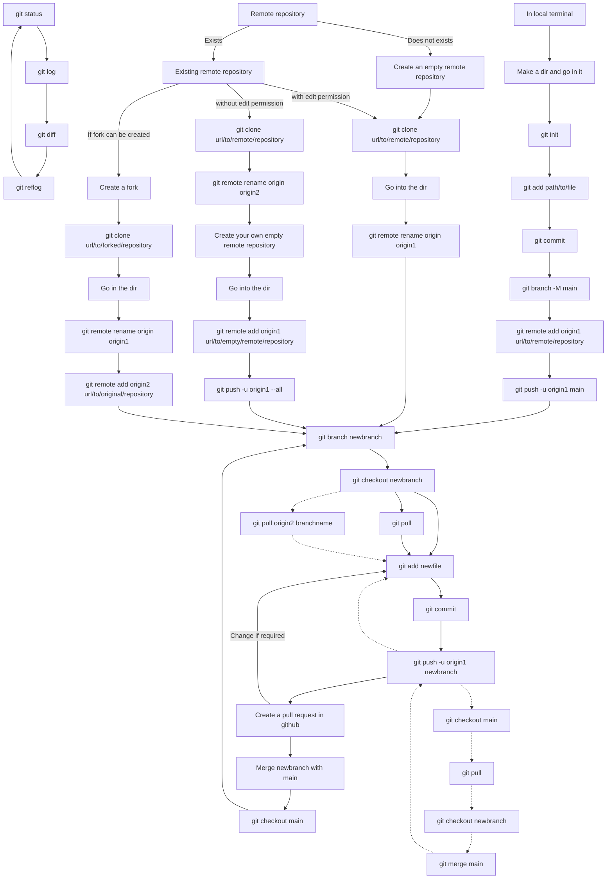

# Mandatory Introduction
Human memory is volatile. We keep forgetting things we `committed` yesterday.
Here comes `git` to help us.

`git` is a nice tool to track the changes of any document, from a piece of code to a latex report.
With this, one not only `saves` a document, but saves the version of the document as it evolves.

**There can be hundreds of objects in a directory. The beauty is that, `git` only tracks those, which
you instruct it to do. It never touches any `data`. This is important when you are running jobs
on a cluster. You can quickly change the code in your local machine, then push it to remote,
then pull it to the cluster. This saves time as you do not need to involve `rsync` in this.**

`GitGub`, `GitLab`, `BitBucket`, etc. uses the same `git` to host the documents tracked by `git`
in our local machine. This gives us more advantages.
- the graphical representation is better than a terminal.
- working on the same code from multiple terminals. **Most important to me**
- one can keep a `remote` copy of the work done in `local` machine.
- one can keep the `remote` public, so that others can see/use it.
- a team of people can collaborate on the same project. Other can discuss and verify before a change
is incorporated in the project.

# BRANCH: Main usefulness of `git`


In the above tree, `blue` is the `main` branch. Nobody touches it directly. One creates a branch of
`main` (shown in `green` and `magenta`) and work in that branch only. Once the testing is satisfied,
one can create a `pull request` to `merge` the branch with `main`. One might add `reviewers` with
the request. Upon approval from all the reviewers, the branch can be merged to main.

# Some useful git commands and the uses of those
*Here I listed some of the git commands and how to use them efficiently or not-efficiently.*

## GIT Manuals
Git has extended manual in Linux. Use the following methods to browse.
```
man git
man git-branch
man git-mv
man git-log
man git-diff
.......
.......
```
One thing to note here. Manual for `git branch` is written in `git-branch`. The `hyphen` is necessary. 

## Flow of git methods:
There are mainly three ways to initialise a `local` git repository. Please continue reading for more details.


## If possible, create the GIT repository first in remote. Then clone it in your local PC.
Use the following command to get the remote repository in your local PC.
```
git clone git@github.com:suryamondal/useful_git_commands.git
cd useful_git_commands
```
This repository comes loaded with necessary files which are required for `git`.

If you already started working at the local PC, then you have to initialise the `git` repository first in your local directory.

### Initialise the Local Repository:
A git `repository` is synonymous to a `folder` or `directory`, but actually not. A git repository
resides inside a physical directory, and that is the end of the similarity.

We go inside the folder/directory named `useful_git_commands`. We then execute the following command.
```
git init
```
This creates a directory named `.git` inside `useful_git_commands` and fills it with all the necessary objects. **We, amateurs, must never cause any harm to this one.**

### Create a readme file:
In git, it is must to have a `README.md` file. It should be in plain ASCII. Please follow [this link](https://docs.github.com/en/get-started/writing-on-github/getting-started-with-writing-and-formatting-on-github/basic-writing-and-formatting-syntax) to know more on how to format it with beauty.

### Make git to track a file:
Git does not automatically track all the files in a directory. We need to `add` the specific files
to `git`. A file can be added to `git` using the following command,
```
git add README.md
```

### First commit:
We have added one file to git. Now we need to `commit` it. Execute the following command to commit.
```
git commit -am "First Commit"
```
**Note**:
- If you do not use the `-a` flag, only the files `staged` are are committed. There may be situations where some modified files might be in the `unstaged` area. You need to execute `git add path/to/file` to bring them into staging are. And then commit using `git commit -m "some message"`. This is useful if you need to commit files separately.
- If you do not use the `-m` flag, an editor (i.e. nano, vim, etc.) will be opened. Write the message there. Then save and exit. Commit is over. You can change the choice of default editor.

### Check the status of git:
The following command display the status. Any files modified, staged or unstaged are displayed here.
```
git status
```
You will notice that the branch name is `master`. We usually change it to `main` for the default branch. For this, execute the following command.
```
git branch -M main
```

Now we are ready to `push` this to a `remote repository`.

### Remote Repository:
This will be an exact copy of the local repository. For this,
- You need to have account on a `git` server (i.e. `github`, `bitbucket`, `gitlab`, etc.).
- Upload your `SSH Keys` to the servers. Follow [this link](https://github.com/suryamondal/ssh_and_github) for details.
- You need to create an empty repository in server (say, `useful_git_commands`).
- Copy the link of the remote (find it in Clone->SSH tab). Then

Execute the following command to add a `remote` repository to your `local` repository. 
```
git remote add origin1 git@github.com:suryamondal/useful_git_commands.git
```
Where, `origin1` is sort of an alias to the remote repository. You can have as many as origins if you want to push/pull from any of them. This is particularly useful if you want to keep a copy of your code to multiple repository.

### Push to a remote repository:
To push the branch `main` to `origin1`, execute the following.
```
git push -u origin1 main
```

### Clone a remote repository to another terminal:
Now say, you pushed a branch to `origin1` from a terminal. You want to get the it to a new terminal.
Just execute the following.
```
git clone git@github.com:suryamondal/useful_git_commands.git
```
This will create a directory named `useful_git_commands` with all the files and `.git` folder.

**Warning:** In this local repository, the alias to `remote` is set as `origin` by default. You might rename it using `git remote rename origin origin1`. 

### Creating a new branch
Now we are in the `main` branch. **We should never edit the main branch directly**. Always create a branch, edit and test everything there. Then merge it to the `main` using a `pull request`.

To create a branch say, `bugfix/add-menu`, use the following command.
```
git branch bugfix/add-menu                  : if from the latest commit
git branch bugfix/add-menu <sha1-of-commit> : if from a previous commit (use 'git log' to get sha hash)
```

Go to the branch using,
```
git checkout bugfix/add-menu
```

Then commit, push, pull using this branch name.

### Pull the changes from a remote, you pushed from a different terminal
```
git pull                : if you want to pull from the default remote
git pull origin1 main   : if you want to pull from a specific remote and branch (use carefully)
```
With `git pull`, the branch `bugfix/add-menu` will also be loaded in this local machine.
use `git checkout bugfix/add-menu` to start editing the branch in this machine.

## Pull Requests
Once your branch is ready and tested, it is time to merge it with the `main`. For this,
- First create a `pull request` in `github`. You may add reviewers for this operation.
- Discussion thread is available in each pull request. Discuss anything if there is conflicts.
- Do the changes if required, then commit, push; if required, then in multiple iterations.
- With each push, the pull request will also get updated.
- Once all the reviewers have approved the request, you can go ahead to `merge` your branch with `main`.

## Forks
If you do not have permission to edit a remote repository, there are two ways to get it to your own remote.
1. Clone it, then push it to your own remote repository.
   - Add the original remote as `origin2`.
   - You can `pull` from the `origin2`, in case any changes in there.
   - Disadvantage: Both are detached, and thus cannot be compared directly.
2. Create a `fork` of that remote, and then `clone` the `fork`. This gives the following added advantages.
   - You will be able to compare both the repositories.
   - You can create a `pull request` from `origin1` to `origin2`.

# GIT DIFF
This is probably the most interesting command of all, if used properly. It can be used in may way.
- `git diff`        : It shows the changes you have done after the last commit
- `git diff main`   : This shows the (committed) difference between `main` and this branch.
- any other possible combinations.

### GIT LOG
I usually push the changes to remote, and then browse it on a browser to check the logs. But one might execute `git log` in local machine to see the commit log. Useful formats,
```
git log                 : shows commit info
git log -p              : shows changes
git log -p <filename>   : shows changes in a specific file
```

### GIT REFLOG
This shows the position of `head`. It is useful if you want to reset to any previous commit, using `git reset --hard bd6903f`. But please try not use it, better to create a branch from that specific commit. It is written above.

### In case a large file is added to git and it is needed to be removed from each commit
```
git filter-branch --force --index-filter 'git rm --cached --ignore-unmatch path/to/file' --prune-empty --tag-name-filter cat -- --all
git push origin1 --force --all
```

### Move all git-traced files/directories to a new directory
```BASH
mkdir -p IPL_v1
git ls-files | while read -r file; do
  mkdir -p "IPL_v1/$(dirname "$file")"
  git mv "$file" "IPL_v1/$file"
done
```
