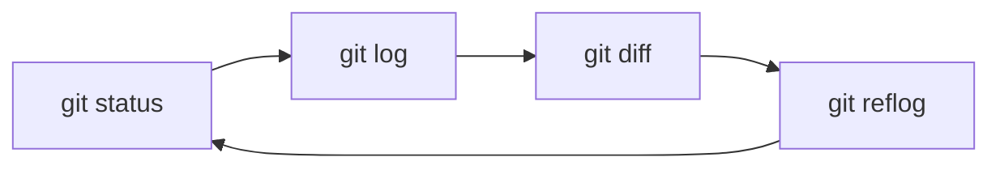
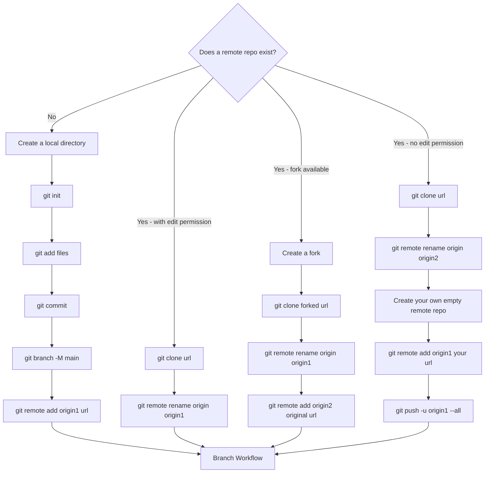
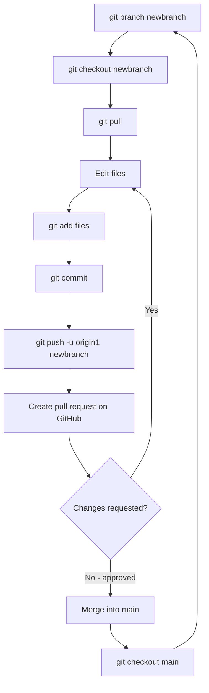

# Introduction

Human memory is volatile. We keep forgetting things we `committed` yesterday.
Here comes `git` to help us.

`git` is a nice tool to track the changes of any document, from a piece of code to a latex report.
With this, one not only `saves` a document, but saves the version of the document as it evolves.

**There can be hundreds of objects in a directory. The beauty is that, `git` only tracks those which
you instruct it to do. It never touches any `data`. This is important when you are running jobs
on a cluster. You can quickly change the code in your local machine, then push it to remote,
then pull it to the cluster. This saves time as you do not need to involve `rsync` in this.**

`GitHub`, `GitLab`, `BitBucket`, etc. use the same `git` to host the documents tracked by `git`
in our local machine. This gives us more advantages.
- the graphical representation is better than a terminal
- working on the same code from multiple terminals — **most important to me**
- one can keep a `remote` copy of the work done in the `local` machine
- one can keep the `remote` public, so that others can see/use it
- a team of people can collaborate on the same project; others can discuss and verify before a change is incorporated

---

## Table of Contents

- [Branching](#branching)
- [Git Manuals](#git-manuals)
- [Workflow Overview](#workflow-overview)
- [Setting Up a Repository](#setting-up-a-repository)
  - [Initialize a Local Repository](#initialize-a-local-repository)
  - [Create a Readme File](#create-a-readme-file)
  - [Track a File](#track-a-file)
  - [First Commit](#first-commit)
  - [Check Status](#check-status)
  - [Add a Remote Repository](#add-a-remote-repository)
  - [Push to Remote](#push-to-remote)
  - [Clone a Remote Repository](#clone-a-remote-repository)
  - [Create a New Branch](#create-a-new-branch)
  - [Pull Changes from Remote](#pull-changes-from-remote)
- [Pull Requests](#pull-requests)
- [Forks](#forks)
- [Git Diff](#git-diff)
- [Git Log](#git-log)
- [Git Reflog](#git-reflog)
- [Remove a Large File from History](#remove-a-large-file-from-history)
- [Move Tracked Files to a New Directory](#move-tracked-files-to-a-new-directory)

---

## Branching


In the above tree, `blue` is the `main` branch. Nobody touches it directly. One creates a branch of
`main` (shown in `green` and `magenta`) and works in that branch only. Once testing is satisfied,
one can create a `pull request` to `merge` the branch with `main`. One might add `reviewers` with
the request. Upon approval from all the reviewers, the branch can be merged to main.

## Git Manuals

Git has extended manuals in Linux. Use the following methods to browse.
```
man git
man git-branch
man git-mv
man git-log
man git-diff
```
Note that the manual for `git branch` is accessed as `git-branch` — the hyphen is required.

## Workflow Overview

### Status Monitoring Loop

Run these commands repeatedly to stay aware of your repository's state.


```mermaid
graph LR
    A[git status] --> B[git log] --> C[git diff] --> D[git reflog] --> A
```

### Initialization Paths

There are three ways to set up a local git repository. All three lead to the same branch workflow.


```mermaid
graph TD
    R{Does a remote repo exist?}

    R -->|No| L1[Create a local directory]
    L1 --> L2[git init]
    L2 --> L3[git add files]
    L3 --> L4[git commit]
    L4 --> L5[git branch -M main]
    L5 --> L6[git remote add origin1 url]
    L6 --> BW[Branch Workflow]

    R -->|Yes - with edit permission| C1[git clone url]
    C1 --> C2[git remote rename origin origin1]
    C2 --> BW

    R -->|Yes - fork available| F1[Create a fork]
    F1 --> F2[git clone forked url]
    F2 --> F3[git remote rename origin origin1]
    F3 --> F4[git remote add origin2 original url]
    F4 --> BW

    R -->|Yes - no edit permission| N1[git clone url]
    N1 --> N2[git remote rename origin origin2]
    N2 --> N3[Create your own empty remote repo]
    N3 --> N4[git remote add origin1 your url]
    N4 --> N5[git push -u origin1 --all]
    N5 --> BW
```

### Branch Workflow


```mermaid
graph TD
    A[git branch newbranch] --> B[git checkout newbranch]
    B --> C[git pull]
    C --> D[Edit files]
    D --> E[git add files]
    E --> F[git commit]
    F --> G[git push -u origin1 newbranch]
    G --> H[Create pull request on GitHub]
    H --> I{Changes requested?}
    I -->|Yes| D
    I -->|No - approved| J[Merge into main]
    J --> K[git checkout main]
    K --> A
```

## Setting Up a Repository

> **Tip:** If possible, create the repository on GitHub/GitLab first, then clone it locally. This avoids the manual remote-setup steps below.

```bash
git clone git@github.com:suryamondal/useful_git_commands.git
cd useful_git_commands
```

The cloned repository comes with all the necessary git configuration files.

If you already started working locally, you need to initialize git in your existing directory instead.

### Initialize a Local Repository

A git `repository` is synonymous to a `folder` or `directory`, but actually not. A git repository
resides inside a physical directory, and that is the end of the similarity.

Go inside the directory and run:
```bash
git init
```
This creates a `.git` directory and fills it with all the necessary objects. **Never modify this directory manually.**

### Create a Readme File

Every git project should have a `README.md` file written in plain ASCII. See [GitHub's formatting guide](https://docs.github.com/en/get-started/writing-on-github/getting-started-with-writing-and-formatting-on-github/basic-writing-and-formatting-syntax) for markdown syntax.

### Track a File

Git does not automatically track all files in a directory. Add specific files using:
```bash
git add README.md
```

### First Commit

```bash
git commit -am "First Commit"
```

**Notes:**
- Without `-a`, only staged files are committed. Use `git add path/to/file` to stage a file, then `git commit -m "message"` to commit. This is useful when committing files separately.
- Without `-m`, an editor (nano, vim, etc.) will open for you to write the message. You can change the default editor in git config.

### Check Status

```bash
git status
```

Displays modified, staged, and unstaged files. You will notice the branch name defaults to `master`. Rename it to `main` with:
```bash
git branch -M main
```

### Add a Remote Repository

Requirements:
- An account on a git server (GitHub, GitLab, Bitbucket, etc.)
- SSH keys uploaded to the server — see [this guide](https://github.com/suryamondal/ssh_and_github)
- An empty repository created on the server

Link the remote to your local repository:
```bash
git remote add origin1 git@github.com:suryamondal/useful_git_commands.git
```

`origin1` is an alias for the remote URL. You can have multiple remotes (e.g. `origin1`, `origin2`) to push or pull from different locations — useful for mirroring a repo across multiple hosts.

### Push to Remote

```bash
git push -u origin1 main
```

### Clone a Remote Repository

To get the repository onto a new machine:
```bash
git clone git@github.com:suryamondal/useful_git_commands.git
```

This creates a `useful_git_commands` directory with all files and the `.git` folder.

> **Note:** The default remote alias after cloning is `origin`. Rename it if needed: `git remote rename origin origin1`.

### Create a New Branch

**Never edit the main branch directly.** Always create a branch, edit and test there, then merge via a pull request.

```bash
# From the latest commit:
git branch bugfix/add-menu

# From a specific previous commit (use 'git log' to find the SHA):
git branch bugfix/add-menu <sha1-of-commit>
```

Switch to the branch:
```bash
git checkout bugfix/add-menu
```

Then commit, push, and pull using this branch name.

### Pull Changes from Remote

```bash
# Pull from the default remote:
git pull

# Pull from a specific remote and branch (use carefully):
git pull origin1 main
```

After pulling, a branch like `bugfix/add-menu` will be available locally. Use `git checkout bugfix/add-menu` to start working on it.

## Pull Requests

Once your branch is ready and tested, it is time to merge it with `main`.
- Create a `pull request` on GitHub. You may add reviewers.
- A discussion thread is available on each pull request for resolving conflicts.
- Make changes if required, then commit and push — the pull request updates automatically with each push.
- Once all reviewers have approved, merge the branch into `main`.

## Forks

If you do not have permission to edit a remote repository, there are two ways to get it into your own remote.

1. **Clone and push to your own remote** — Add the original remote as `origin2` so you can pull updates from it. Disadvantage: both repositories are detached and cannot be compared directly on GitHub.

2. **Create a fork** — Fork the repository on GitHub, then clone the fork. Added advantages:
   - You can compare both repositories on GitHub.
   - You can create a `pull request` from `origin1` to `origin2`.

## Git Diff

Probably the most useful command when used well.

```bash
git diff        # changes since the last commit
git diff main   # committed differences between main and the current branch
```

## Git Log

Browse commit history. Usually easier to read on GitHub, but useful locally too.

```bash
git log                  # shows commit info
git log -p               # shows changes
git log -p <filename>    # shows changes in a specific file
```

## Git Reflog

Shows the position of `HEAD`. Useful if you want to reset to a previous commit:
```bash
git reset --hard bd6903f
```

Prefer creating a new branch from that specific commit over hard-resetting where possible.

## Remove a Large File from History

```bash
git filter-branch --force --index-filter 'git rm --cached --ignore-unmatch path/to/file' --prune-empty --tag-name-filter cat -- --all
git push origin1 --force --all
```

## Move Tracked Files to a New Directory

```bash
mkdir -p IPL_v1
git ls-files | while read -r file; do
  mkdir -p "IPL_v1/$(dirname "$file")"
  git mv "$file" "IPL_v1/$file"
done
```
